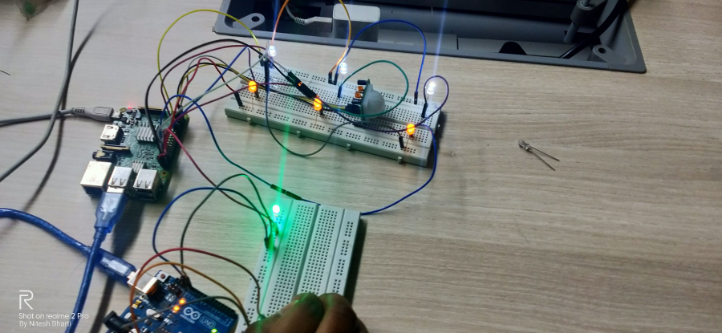
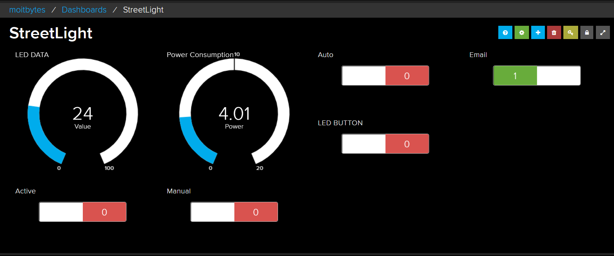

# SmartGully

India is the world's third-largest producer and consumer of electricity. It has therefore also become a huge responsibility to minimise power consumption and wastage to promote an efficient energy usage method. One such example of enormous power consumption is due to street lights or light poles. In the world, several trillion kWh are expended on street lighting annually ergo billing of street lights is a huge penalty. 

Generic street lights have just two options – ON & OFF, they cannot be adjusted or controlled according to the amount of light present in the environment and hence lead to energy wastage. Our project, SmartGully is an advanced photosensitive IOT device that automates the turning on and off of street lamps by detecting darkness and activating motion sensors to detect motion. During the day, even if it detects motion, the street lights remain turned off optimising power usage. The motion sensor turns the street lights on when darkness is detected and pedestrians, animals or vehicles pass by. This increases safety on roads in a much efficient way and therefore prevents accidents owing to a safer route of travel. The lights are turned off by default when no motion is sensed during the night. 

SmartGully also sends a notification summarising the power consumption on a daily basis. Additionally, the user interface allows the operator/user to monitor the live power consumption of any particular area letting them keep a tab on the power usage at some instantaneous time and hence making it easier to detect any malfunction/damage of street lights in that particular region. This can also be done through the android application. This application allows user to remotely access the lamp status and modify the lamp mode and lamp settings. This makes street light maintenance way easier than it is today. We provide two modes, AUTO and MANUAL mode which can be switched using the application. The auto mode automates the turning on and off of the street lights through motion sensors. The manual mode puts the motion detector off and allows user to manage manually, the turning on-off of street lights in that case. 

Saving power is not only to avoid big bills. It is to make a sustainable environment for the future generation and smARTGully will help us take a huge step towards achieving the same.

### [Backend Repo](https://git.zerobot.xyz/anantankur/gullyarApi)

.jpeg)

